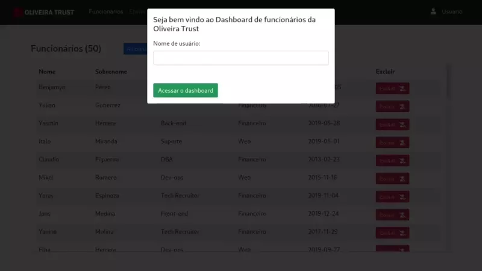

## Desafio Front-end Oliveira Trust

---

### [Wireframe no figma](https://www.figma.com/file/4k37mJlGpRxVULJ88gfWYR/oliveira-trust_desafio_frontend?node-id=0%3A1)

### Tecnologias
  - HTML
  - CSS
  - Bootstrap
  - Javascript

### Características
  - Dashboard de funcionários, com 50 elementos iniciais
  - Dados iniciais gerados por: [generatedata.com](https://www.generatedata.com/)
  - Registro de usuário no primeiro acesso → salvo no localstorage
  - Exibir nome do usuário
  - Adicionar funcionário(s) → sobe um modal de formulário
  - Remover funcionário(s)
  - Contador de elementos da tabela
  - Seção de enviar arquivos → oculta por padrão, aparece ao clique
  - Scripts modularizados em arquivos separados
  - Responsividade através dos containers bootstrap
  - CSS para fazer pequenos ajustes no layout

### Demonstração
